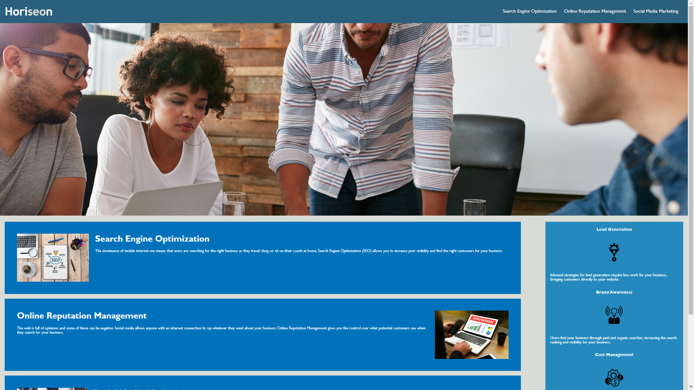

# Refactoring

## Description

This project involves updating the CSS and HTML of a lanading page

## Table of Contents 

* [License](#license)

* [Questions](#questions)

* [Links](#links)

* [Screenshot] (#screenshot)

## License

This project is licensed under the MIT license.
 
## Questions

If you have any questions about the repo, open an issue or contact me directly at schorij23@gmail.com. You can find more of my work at [https://github.com/schorij23](https://github.com/https://github.com/schorij23/).

## Links
Deployed updated landing page link (https://schorij23.github.io/week-1-challenge/)

## Screenshot
